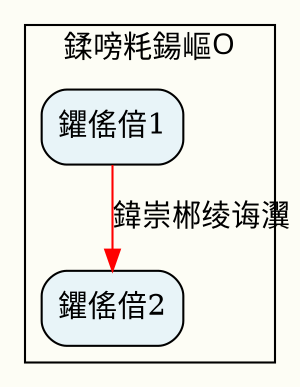

---
name: research-to-diagram
description: 娣卞害璋冪爺涓婚骞惰嚜鍔ㄧ敓鎴愮煡璇嗗叧绯诲浘璋盤DF銆傛帴鏀剁爺绌朵富棰樺悗鑷姩杩涜缃戠粶璋冪爺銆佷俊鎭敹闆嗐€佺煡璇嗘暣鐞嗭紝鏈€缁堢敓鎴愪笓涓氱殑鍙鍖栧叧绯诲浘璋便€傞€傜敤浜?鐮旂┒...骞跺仛鍥?銆?娣卞害鍒嗘瀽...骞跺彲瑙嗗寲"銆?鐢熸垚鐭ヨ瘑鍥捐氨"绛夊満鏅€?Do NOT use for text-only reports (use deep-research instead).
license: MIT
version: 0.1.0
metadata:
  category: research-knowledge
---

# Research to Diagram

娣卞害璋冪爺涓婚骞惰嚜鍔ㄧ敓鎴愮煡璇嗗叧绯诲浘璋盤DF銆備粠鐮旂┒鍒板彲瑙嗗寲鐨勪竴绔欏紡宸ュ叿銆?

## Description

杩欎釜 Skill 鎺ユ敹鐢ㄦ埛鎻愪緵鐨勭爺绌朵富棰橈紝鑷姩杩涜娣卞害缃戠粶璋冪爺銆佷俊鎭敹闆嗐€佺煡璇嗘暣鐞嗐€佺粨鏋勮璁★紝鏈€缁堢敓鎴愪笓涓氱殑鍙鍖栧叧绯诲浘璋盤DF銆備笌 `structure-to-pdf` 涓嶅悓锛屾湰 Skill 涓撴敞浜?*涓诲姩鐮旂┒鍜岀煡璇嗘寲鎺?*锛岃€岄潪琚姩鐨勬暟鎹浆鎹€?

## 鏍稿績鐗规€?

- **鑷姩璋冪爺**锛氫娇鐢?WebSearch 杩涜澶氳疆娣卞害璋冪爺
- **鏅鸿兘鏁寸悊**锛氳嚜鍔ㄦ彁鍙栥€佸垎绫汇€佺粨鏋勫寲淇℃伅
- **涓撲笟璁捐**锛氭牴鎹富棰樼壒鐐归€夋嫨鏈€浣冲彲瑙嗗寲鏂规
- **澶氱杈撳嚭**锛氭敮鎸?Graphviz銆丳lantUML銆丮ermaid 绛夊伐鍏?
- **楂樿川閲廝DF**锛氱敓鎴愮煝閲忓浘褰紝鍙棤闄愮缉鏀?

## Trigger Conditions

褰撶敤鎴锋兂瑕侊細
- 鐮旂┒鏌愪釜澶嶆潅涓婚鐨勭煡璇嗙粨鏋勶紙濡?绾㈡ゼ姊︿汉鐗╁叧绯?锛?
- 鐢熸垚浜虹墿鍏崇郴鍥俱€佹蹇靛浘璋便€佺煡璇嗗浘璋?
- 鐞嗚В鏌愪釜棰嗗煙鐨勭粍缁囨灦鏋勩€佹妧鏈灦鏋?
- 鍙鍖栧鏉傜殑鍏崇郴缃戠粶
- 闇€瑕佷粠闆跺紑濮嬬爺绌跺苟鍙鍖栨煇涓富棰?

**鍏抽敭璇?*锛?
- "璋冪爺...骞跺仛鍥?
- "鐮旂┒...鐨勫叧绯?
- "娣卞害鍒嗘瀽...骞跺彲瑙嗗寲"
- "鐢熸垚...鐭ヨ瘑鍥捐氨"
- "鐢?..鍏崇郴鍥?锛堟棤鐜版垚鏁版嵁锛?

## Workflow

### 1. 浠诲姟瑙勫垝锛圱odoWrite锛?
```
- 娣卞害璋冪爺涓婚鍜岀浉鍏崇煡璇?
- 璁捐鍥捐氨缁撴瀯鍜屽眰娆?
- 鍒涘缓鍙鍖栧浘琛?
- 鐢熸垚PDF鏂囨。
```

### 2. 娣卞害璋冪爺闃舵
- **澶氳疆 WebSearch**锛氫粠涓嶅悓瑙掑害鏀堕泦淇℃伅
  - 涓婚姒傝堪鍜岃儗鏅?
  - 鏍稿績瑕佺礌鍜屼汉鐗?姒傚康
  - 鍏崇郴鍜岃仈绯?
  - 灞傛鍜屽垎绫?
- **淇℃伅婧愯褰?*锛氫繚瀛樻墍鏈夊弬鑰冭祫鏂欓摼鎺?
- **鐭ヨ瘑鎻愬彇**锛氳瘑鍒叧閿疄浣撳拰鍏崇郴

### 3. 缁撴瀯璁捐闃舵
鏍规嵁涓婚绫诲瀷閫夋嫨鏈€浣崇粨鏋勶細

**浜虹墿鍏崇郴鍥?*锛?
- 瀹舵棌璋辩郴锛氬灞傛鏍戠姸缁撴瀯
- 绀句細缃戠粶锛氱綉鐘跺叧绯诲浘
- 缁勭粐鏋舵瀯锛氬眰娆″寲甯冨眬

**姒傚康鍥捐氨**锛?
- 鐭ヨ瘑鍒嗙被锛氭爲鐘舵垨鎬濈淮瀵煎浘
- 姒傚康鍏崇郴锛氭湁鍚戝浘
- 娴佺▼鍥撅細绾挎€ф垨鍒嗘敮娴佺▼

**鎶€鏈灦鏋?*锛?
- 绯荤粺缁勪欢锛氭ā鍧楀寲甯冨眬
- 渚濊禆鍏崇郴锛氬眰娆℃垨缃戠粶鍥?
- 鏁版嵁娴佸悜锛氭祦绋嬪浘

### 4. 鍙鍖栧疄鐜?

浼樺厛浣跨敤 **Graphviz** (DOT 璇█)锛?


**澶囬€夊伐鍏?*锛?
- PlantUML锛歎ML 鍥俱€佹椂搴忓浘
- Mermaid锛氱畝鍗曟祦绋嬪浘銆佹椂搴忓浘

### 5. PDF 鐢熸垚
```bash
dot -Tpdf diagram.dot -o output.pdf
```

### 6. 鏂囨。鏁寸悊
鍙€夌敓鎴愯鏄庢枃妗ｏ紝鍖呭惈锛?
- 鐮旂┒涓婚姒傝堪
- 鍥捐氨璇存槑
- 鍙傝€冭祫鏂欐潵婧愶紙Sources锛?
- 浣跨敤璇存槑

## 璁捐鍘熷垯

### 瑙嗚璁捐
1. **棰滆壊缂栫爜**锛氫娇鐢ㄤ笉鍚岄鑹插尯鍒嗙被鍒?
2. **褰㈢姸鍖哄垎**锛氫笉鍚岀被鍨嬪疄浣撶敤涓嶅悓褰㈢姸
3. **灞傛娓呮櫚**锛氫娇鐢?subgraph cluster 鍒嗙粍
4. **鍏崇郴鏍囨敞**锛氳竟鐨勯鑹层€佹牱寮忋€佹爣绛捐〃杈惧叧绯荤被鍨?
5. **涓枃鏀寔**锛氫娇鐢?"Arial Unicode MS" 鎴栫郴缁熶腑鏂囧瓧浣?

### 淇℃伅灞傛
1. **鏍囬灞?*锛氫富鏍囬
2. **鍒嗙粍灞?*锛氫富瑕佺被鍒?瀹舵棌
3. **瀹炰綋灞?*锛氬叿浣撲汉鐗?姒傚康
4. **鍏崇郴灞?*锛氳繛鎺ュ拰鏍囨敞
5. **鍥句緥灞?*锛氳鏄庣鍙峰惈涔?

### 甯冨眬绛栫暐
- **rankdir=TB**锛氳嚜涓婅€屼笅锛堝鏃忔爲銆佺粍缁囨灦鏋勶級
- **rankdir=LR**锛氫粠宸﹀埌鍙筹紙娴佺▼鍥俱€佹椂闂寸嚎锛?
- **rankdir=BT**锛氳嚜涓嬭€屼笂锛堜緷璧栧浘锛?
- **splines=ortho**锛氭浜よ竟锛堟竻鏅扮殑缁勭粐鍥撅級
- **splines=curved**锛氭洸绾胯竟锛堢編瑙傜殑鍏崇郴缃戯級

## 杈撳嚭鏂囦欢

榛樿淇濆瓨浣嶇疆锛歚~/Downloads/` 鎴栫敤鎴锋寚瀹氱洰褰?

鐢熸垚鏂囦欢锛?
- `<topic>_relations.dot` - Graphviz 婧愭枃浠?
- `<topic>_relations.pdf` - 鏈€缁圥DF鍥捐氨
- `<topic>_sources.md` - 鍙傝€冭祫鏂欙紙鍙€夛級

## 浣跨敤绀轰緥

### 绀轰緥 1锛氭枃瀛︿綔鍝佷汉鐗╁叧绯?
```
鐢ㄦ埛锛氭繁搴﹁皟鏌ャ€婁笁鍥芥紨涔夈€嬮噷浜虹墿涔嬮棿鐨勫叧绯伙紝鐒跺悗鍋氫釜缁撴瀯鍥?PDF
```

Skill 鎵ц锛?
1. 璋冪爺涓夊浗涓昏浜虹墿銆侀樀钀ャ€佸叧绯?
2. 璁捐锛氶瓘铚€鍚翠笁澶ч樀钀?+ 浜虹墿灞傛 + 鑱旂洘/瀵规姉鍏崇郴
3. 浣跨敤 Graphviz 鍒涘缓澶氬眰娆″叧绯诲浘
4. 鐢熸垚 PDF

### 绀轰緥 2锛氭妧鏈蹇靛浘璋?
```
鐢ㄦ埛锛氱爺绌?Kubernetes 鏋舵瀯骞剁敓鎴愬彲瑙嗗寲鍥捐氨
```

Skill 鎵ц锛?
1. 璋冪爺 K8s 鏍稿績缁勪欢銆佹灦鏋勫眰娆?
2. 璁捐锛氭帶鍒跺钩闈?鏁版嵁骞抽潰/鎻掍欢鐢熸€?
3. 鐢熸垚鎶€鏈灦鏋勫浘
4. 杈撳嚭 PDF

### 绀轰緥 3锛氬巻鍙蹭簨浠跺叧绯?
```
鐢ㄦ埛锛氬垎鏋愪簩鎴樹富瑕佸浗瀹跺拰鑱旂洘鍏崇郴锛屽仛鎴愬浘琛?
```

Skill 鎵ц锛?
1. 璋冪爺鍙傛垬鍥藉銆侀樀钀ャ€佸叧閿椂闂磋妭鐐?
2. 璁捐锛氳酱蹇冨浗/鍚岀洘鍥?涓珛鍥藉叧绯荤綉
3. 鐢熸垚甯︽椂闂寸嚎鐨勫叧绯诲浘
4. 杈撳嚭 PDF

## 涓?structure-to-pdf 鐨勫尯鍒?

| 鐗规€?| research-to-diagram | structure-to-pdf |
|------|---------------------|------------------|
| 杈撳叆 | 浠呬富棰?鐮旂┒闂 | 鐜版垚鐨勭粨鏋勫寲鏁版嵁 |
| 璋冪爺 | 鉁?鑷姩娣卞害璋冪爺 | 鉂?鏃犻渶璋冪爺 |
| 鐭ヨ瘑鏁寸悊 | 鉁?鑷姩鎻愬彇鍜岀粨鏋勫寲 | 鉂?鐩存帴浣跨敤鐢ㄦ埛鏁版嵁 |
| 搴旂敤鍦烘櫙 | 鐭ヨ瘑鎺㈢储銆佺爺绌跺彲瑙嗗寲 | 蹇€熸暟鎹浆鎹?|
| 鏃堕棿 | 杈冮暱锛堥渶璋冪爺锛?| 蹇€?|

**浣曟椂浣跨敤鏈?Skill**锛?
- 鉁?娌℃湁鐜版垚鏁版嵁锛岄渶瑕佷粠闆剁爺绌?
- 鉁?鎯宠娣卞害浜嗚В鏌愪釜涓婚鐨勭煡璇嗙粨鏋?
- 鉁?闇€瑕佹潈濞佹潵婧愭敮鎸佺殑鍙鍖?

**浣曟椂浣跨敤 structure-to-pdf**锛?
- 鉁?宸叉湁缁撴瀯鍖栨暟鎹?
- 鉁?闇€瑕佸揩閫熻浆鎹负鍥捐〃
- 鉁?鏁版嵁鏍煎紡绠€鍗曟竻鏅?

## 渚濊禆宸ュ叿

**蹇呴渶**锛?
- Graphviz: 鑷姩妫€娴嬪畨瑁呬綅缃紝鏀寔璺ㄥ钩鍙?
  - macOS: `brew install graphviz`
  - Linux: `sudo apt-get install graphviz`
  - Windows: `winget install Graphviz.Graphviz` 鎴栦粠 https://graphviz.org/download/ 涓嬭浇
- WebSearch: Claude Code 鍐呯疆

**鍙€?*锛?
- PlantUML: `brew install plantuml`
- Mermaid CLI: `npm install -g @mermaid-js/mermaid-cli`

## Graphviz 鑷姩妫€娴?

鏈?Skill 鍖呭惈鑷姩妫€娴?Graphviz 瀹夎浣嶇疆鐨勫姛鑳斤細

- 鑷姩妫€娴嬫搷浣滅郴缁燂紙Windows銆乵acOS銆丩inux锛?
- 棣栧厛妫€鏌?PATH 鐜鍙橀噺
- 濡傛灉 PATH 涓湭鎵惧埌锛屾悳绱㈠父瑙佸畨瑁呬綅缃細
  - Windows: `C:\Program Files\Graphviz\bin\dot.exe`
  - macOS: `/usr/local/bin/dot`, `/opt/homebrew/bin/dot`
  - Linux: `/usr/bin/dot`, `/usr/local/bin/dot`
- Windows 涓嬩娇鐢?PowerShell 鎼滅储 Program Files

**娉ㄦ剰**锛氬嵆浣?Graphviz 鏈湪 PATH 涓紝Skill 涔熻兘鑷姩鎵惧埌骞朵娇鐢ㄥ畠銆?

## 閰嶇疆閫夐」

鐢ㄦ埛鍙互閫氳繃鍙傛暟鑷畾涔夛細
- `--tool`: 鎸囧畾鍙鍖栧伐鍏?(graphviz/plantuml/mermaid)
- `--layout`: 鎸囧畾甯冨眬鏂瑰悜 (TB/LR/BT/RL)
- `--output`: 鎸囧畾杈撳嚭鐩綍
- `--depth`: 璋冪爺娣卞害 (quick/medium/deep)
- `--sources`: 鏄惁鐢熸垚鍙傝€冭祫鏂欐枃妗?

## 鏈€浣冲疄璺?

1. **鏄庣‘涓婚鑼冨洿**锛氫富棰樿秺鍏蜂綋锛屽浘璋辫秺娓呮櫚
2. **鍚堢悊鍒嗙粍**锛氫娇鐢?cluster 灏嗙浉鍏冲疄浣撳垎缁?
3. **鎺у埗澶嶆潅搴?*锛氬崟涓浘璋变笉瓒呰繃 50 涓妭鐐?
4. **娓愯繘缁嗗寲**锛氬厛鐢熸垚鎬昏鍥撅紝鍐嶆繁鍏ョ粏鑺?
5. **棰滆壊涓€鑷?*锛氬悓绫诲疄浣撲娇鐢ㄧ浉鍚岄厤鑹?
6. **鏍囨敞鏉ユ簮**锛氬湪 PDF 搴曢儴鎴栧崟鐙枃妗ｆ爣娉ㄥ弬鑰冭祫鏂?

## 甯歌鍥捐氨绫诲瀷妯℃澘

### 浜虹墿鍏崇郴鍥炬ā鏉?
```dot
- 瀹舵棌/缁勭粐鐢?cluster 鍒嗙粍
- 浜虹墿鐢?box/ellipse锛岄噸瑕佷汉鐗╃敤鐗规畩褰㈢姸
- 琛€缂樺叧绯荤敤瀹炵嚎锛屽濮荤敤绾㈣壊锛屽叾浠栫敤铏氱嚎
- 娣诲姞鍥句緥璇存槑绗﹀彿鍚箟
```

### 姒傚康鍥捐氨妯℃澘
```dot
- 椤跺眰姒傚康鍦ㄤ笂鏂?
- 瀛愭蹇甸€愬眰灞曞紑
- is-a 鍏崇郴鐢ㄥ疄绾匡紝has-a 鐢ㄨ櫄绾?
- 浣跨敤棰滆壊鍖哄垎涓嶅悓绫诲埆
```

### 鎶€鏈灦鏋勫浘妯℃澘
```dot
- 鍒嗗眰鏋舵瀯鐢?rankdir=TB
- 缁勪欢鐢ㄧ煩褰紝鏈嶅姟鐢ㄥ渾瑙掔煩褰?
- 渚濊禆鍏崇郴鐢ㄧ澶?
- 鍏抽敭璺緞鐢ㄧ矖绾挎垨鐗规畩棰滆壊
```

## 鏁呴殰鎺掗櫎

### Graphviz 鐩稿叧闂

**闂锛氭壘涓嶅埌 Graphviz**
- 鐥囩姸锛氶敊璇秷鎭?"Graphviz is not installed or not found"
- 瑙ｅ喅鏂规锛?
  1. 纭 Graphviz 宸插畨瑁?
  2. 濡傛灉浣跨敤 Windows锛岀‘淇濆畨瑁呰矾寰勬纭?
  3. Skill 浼氳嚜鍔ㄦ悳绱㈠父瑙佷綅缃紝涓€鑸棤闇€鎵嬪姩閰嶇疆

**闂锛歞ot 鍛戒护涓嶅湪 PATH 涓?*
- 鐥囩姸锛氱郴缁熸彁绀烘壘涓嶅埌 dot 鍛戒护
- 瑙ｅ喅鏂规锛氭湰 Skill 浼氳嚜鍔ㄦ煡鎵?Graphviz锛屾棤闇€娣诲姞鍒?PATH

**闂锛歐indows 涓?Graphviz 瀹夎鍚庝粛鎵句笉鍒?*
- 鍙兘鍘熷洜锛氬畨瑁呰矾寰勪笉鍦ㄩ粯璁や綅缃?
- 瑙ｅ喅鏂规锛?
  1. 纭瀹夎璺緞锛堥€氬父鏄?`C:\Program Files\Graphviz\`锛?
  2. Skill 浼氫娇鐢?PowerShell 鎼滅储 Program Files
  3. 濡傛灉瀹夎鍦ㄥ叾浠栦綅缃紝鎵嬪姩娣诲姞鍒?PATH

### 鍙鍖栭棶棰?

**涓枃鏄剧ず涔辩爜**锛?
```dot
graph [fontname="Arial Unicode MS"]
node [fontname="Arial Unicode MS"]
edge [fontname="Arial Unicode MS"]
```

**鍥捐氨杩囦簬澶嶆潅**锛?
- 浣跨敤 `concentrate=true` 鍚堝苟鐩稿悓杈?
- 鍒嗗壊鎴愬涓瓙鍥?
- 浣跨敤涓嶅悓鐨?rankdir

**甯冨眬涓嶇悊鎯?*锛?
- 璋冩暣 `ranksep` 鍜?`nodesep`
- 浣跨敤 `rank=same` 寮哄埗鑺傜偣鍚屽眰
- 灏濊瘯涓嶅悓鐨?`splines` 璁剧疆

### 鐢熸垚鏍煎紡闂

**闇€瑕佸叾浠栨牸寮?*锛?
```bash
# 浣跨敤鑴氭湰鐢熸垚 PNG锛堥粯璁ゅ悓鏃剁敓鎴?PDF 鍜?PNG锛?
scripts/generate_pdf.sh diagram.dot output.pdf output.png

# 鍙敓鎴?PNG
scripts/generate_pdf.sh diagram.dot --png-only
```

## 鐗堟湰鍘嗗彶

- **v1.1** (2026-01-02): 鏀硅繘 Graphviz 妫€娴?
  - 娣诲姞璺ㄥ钩鍙?Graphviz 鑷姩妫€娴嬪姛鑳?
  - 鏀寔 Windows銆乵acOS銆丩inux 鑷姩鏌ユ壘
  - Windows 涓嬩娇鐢?PowerShell 鎼滅储 Program Files
  - 鏀硅繘閿欒澶勭悊鍜屾枃浠堕攣瀹氶棶棰?
  - 榛樿鍚屾椂鐢熸垚 PDF 鍜?PNG 鏍煎紡
  - 鏇存柊鏁呴殰鎺掗櫎鏂囨。

- **v1.0** (2026-01-02): 鍒濆鐗堟湰
  - 鍩轰簬銆婄孩妤兼ⅵ銆嬩汉鐗╁叧绯诲浘璋遍」鐩€荤粨
  - 鏀寔 Graphviz 鑷姩鐢熸垚
  - 闆嗘垚 WebSearch 娣卞害璋冪爺
  - TodoWrite 浠诲姟绠＄悊
